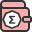
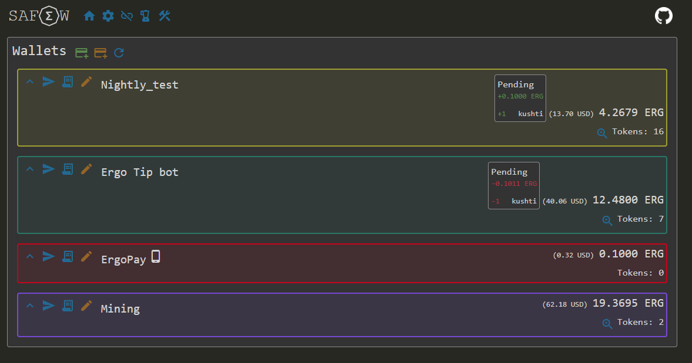
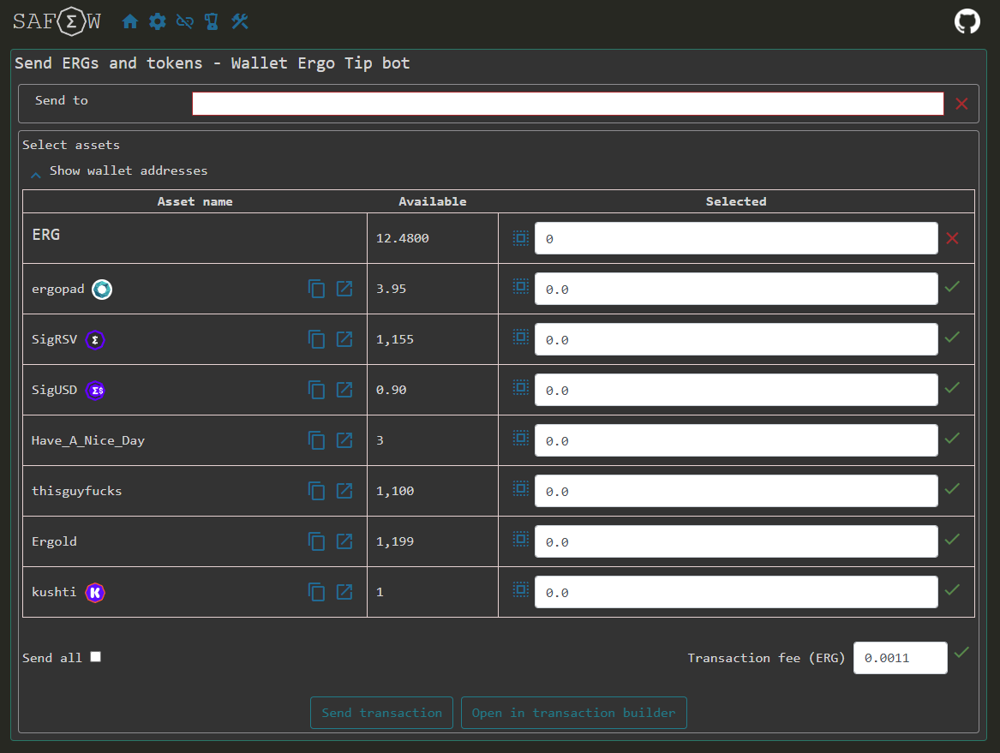
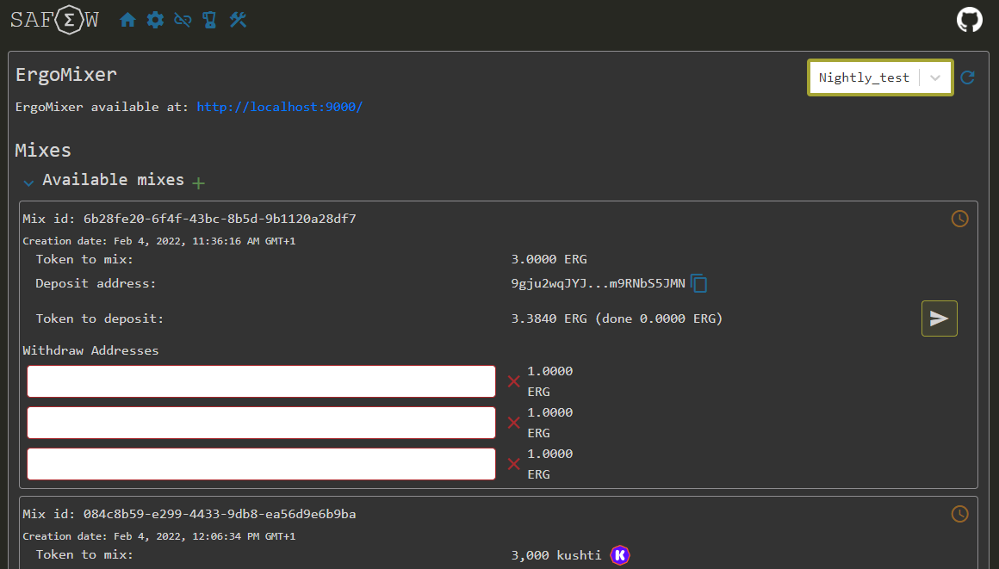
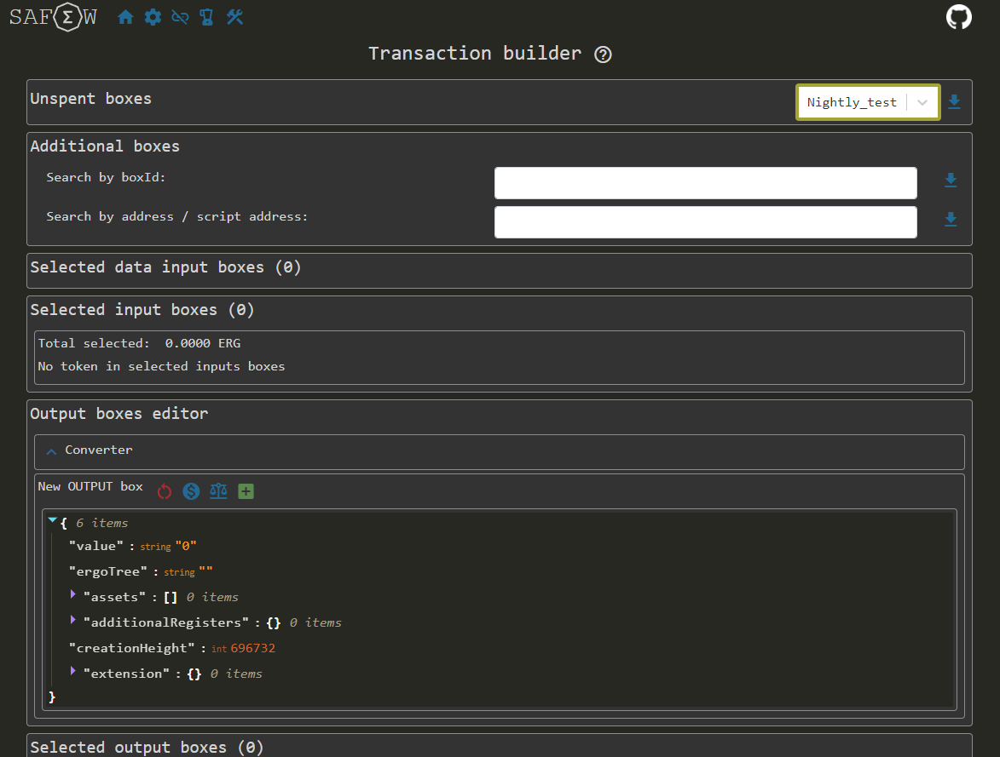
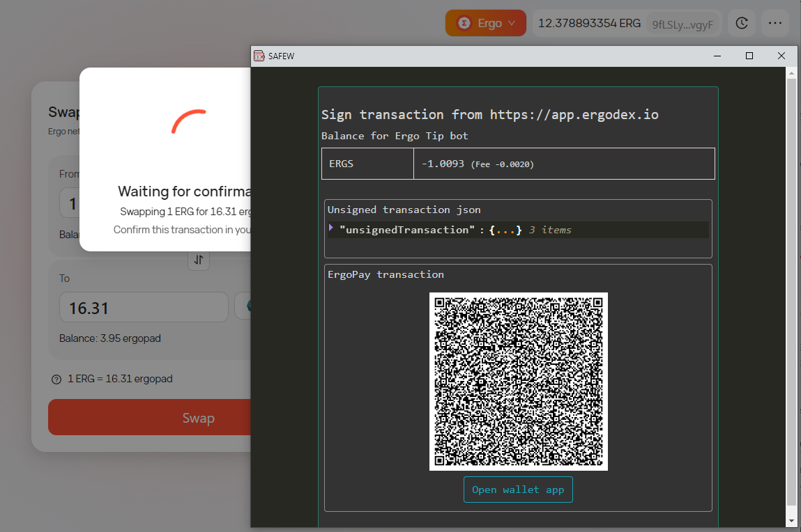
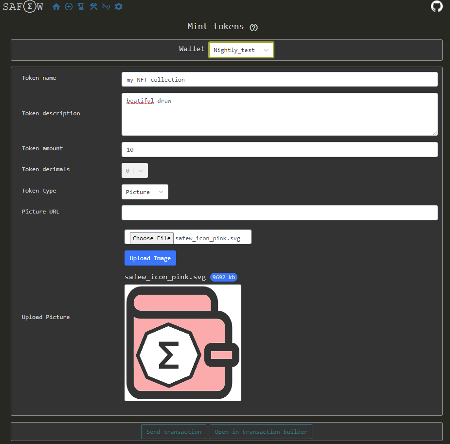
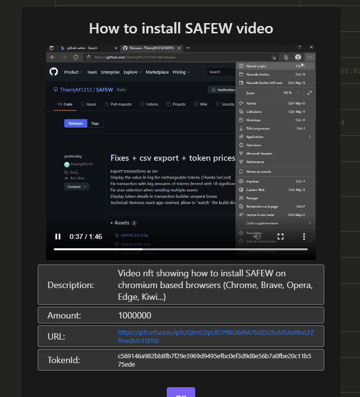

#  SAFEW

Simple And Fast Ergo Wallet

Ergo wallet integrating a dApp connector compatible EIP-12.

SAFEW is compatible with 
- Chrome based browser (Opera, Brave, Edge...) but not released on Chrome store yet.
- Firefox 

SAFEW was awarded as project participating in ErgoHack 3: https://ergoplatform.org/en/blog/2022-03-01-ergohack-iii-results/

## Releases
- For Chrome, Edge, Brave, ... download at: https://github.com/ThierryM1212/SAFEW/releases. How to install: https://www.youtube.com/watch?v=4ZEIcr0udkI
- For Firefox: https://addons.mozilla.org/en-US/firefox/addon/safew/

## Features
Wallet features:
 - Add, restore, edit wallets (BIP-32/39)
 - View accounts (expert mode), addresses, their balance in ERG and tokens
 - Discovers wallet used addresses and generates unused addresses (BIP-44)
 - View wallet transactions confirmed and unconfirmed
 - Display unconfirmed balances per wallet, account and address
 - Configure Explorer, Node and Explorer UI addresses used by the wallet
 - ErgoPay/ReadOnly wallet and signing (only the public address are provided, signing is delegated to ErgoPay EIP-19 with iOS or Android wallet v1.6+)
 - ErgoMixer access: interact with ErgoMixer directly from the wallet
 - Transaction builder to manipulate json of ergo transaction in Expert mode
   - How to mint tokens: https://youtu.be/YR0jkbMLaAY
   - How to burn tokens: https://youtu.be/OcyziMIXTtk
   - How to send asset to several addresses: https://youtu.be/3N7Qn2BgH0U
 - Export wallet transactions as csv
 - Display NFT pictures, audio and videos
 - Mint tokens, pictures, audio and videos
 - Burn tokens
 - Chained transactions (send another transaction as soon as your transaction is visible in Explorer in unconfirmed state)

## Security
The wallets are stored in the local storage of the SAFEW browser extension. 
The mnemonic is encrypted (AES-256) with the spending password, that is not stored in the application. 
The password will be required to spend funds or to add or discover new addresses. 
You can use ErgoPay wallet to keep your secrets on a mobile device (iOS or Android wallet) 
ErgoPay wallets are available to sign remotely the transaction using iOS or Android wallet v1.6+, to avoid to store the encrypted mnemonic in your browser extension local storage. 

## Privacy
The address discovery can be launched at any time to generate unused addresses in the wallets. 
Non connected sites have no access to the information of your wallet. 
Connected sites can read the wallet content. 
The explorer and node used to interact with Ergo blockchain are configurable. 
ErgoPay/ReadOnly wallets allow you to keep the content of your wallet hidden.. 
ErgoMixer integration ease the usage of privacy tools. 

## Reliability
The transaction balance displayed when sending funds using SAFEW is computed from the unsigned transaction, not from the UI inputs. 

## Build the project
> git clone https://github.com/ThierryM1212/SAFEW.git 
> cd SAFEW  
> npm install  
> npm run build-prod  
 
Load the unpacked extension as described at: https://developer.chrome.com/docs/extensions/mv3/getstarted/  
 
It requires to disable Yoroi or Nautilus extension to use the dApp connector. 

## debug
> npm run watch 
And reload the extension from the build directory 
Set the key "debug" = "true" in the local storage to display dApp connector popups buttons 

## dApp Connector
It tries to follow https://github.com/Emurgo/Emurgo-Research/blob/master/ergo/EIP-0012.md
sign_tx_input, sign_data and add_external_box are not implemented yet

Same ergo_request_read_access and ergo_check_read_access than Yoroi method are declared to ensure the compatibility of existing dApp using Yoroi.

## Next steps ?
Publish on Chrome Web Store (currently blocked by https://bugs.chromium.org/p/chromium/issues/detail?id=1173354 and the requirement to publish the new extensions with manifest v3) 
Publish on Opera Addons (available on Opera beta store waiting for validation) 
Ledger signing (Waiting on ledger-ergo-app fix) 
 

## Sample screens

## Release notes
v0.3
- ErgoPay improvement: allow to delete mnemonic to convert a wallet to an ErgoPay wallet, add/remove addresses from Ergopay wallets, add ErgoPay button for mobile users
- ErgoMixer integration: Display available Mixes, send mix transactions from the wallet, manage covert addresses
- Update dApp connector functions to allow future Wallet selector in dApps
- Update dependencies, cleanup lint

v0.4
- Transaction builder integration
- bug fixes

v0.4.1
- Firefox support
- bug fixes

v0.4.2
- Export transactions as csv
- Display the value in Erg for exchangeable tokens (Thanks SoCool)
- Fix transaction with big amounts of tokens (tested with 18 significant numbers)
- Fix Utxo selection when sending multiple assets
- Display token details in transaction builder unspent boxes
- Technical: Remove react-app-rewired, allow to "watch" the build directory (Thanks SoCool)

v0.4.3
- Display NFT images
- Fix csv transaction export
- Fix send tokens that was failing to generate the transaction for some assets

v0.4.4
- Display NFT Images (improved), Audio, Videos
- Mint tokens, Images, Audio and Videos
- Burn tokens
- Bug fixes

v0.4.5
- Fix Ergodex connection
- UI adjustment

v0.4.6
- Chained transactions support in wallet and with dApp connector
- Add caching for some explorer requests
- Improve csv export with UTC date and full ERG amount
- Added COMET and Mi Goreng verified tokens
- Bug fix

v0.4.7
- Ergold logo
- Bug fix in transaction csv export
